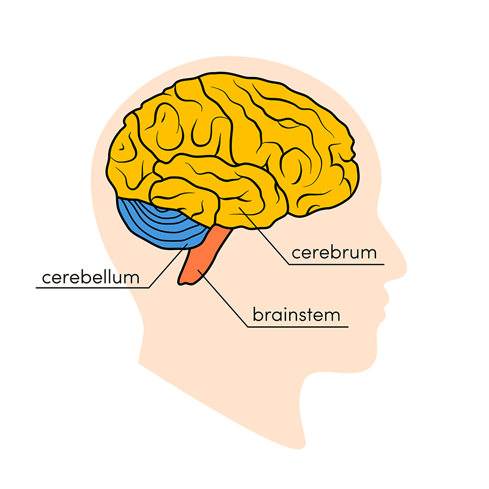
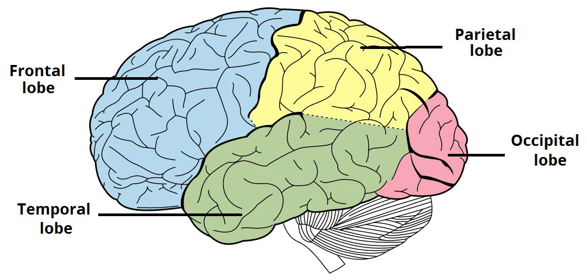
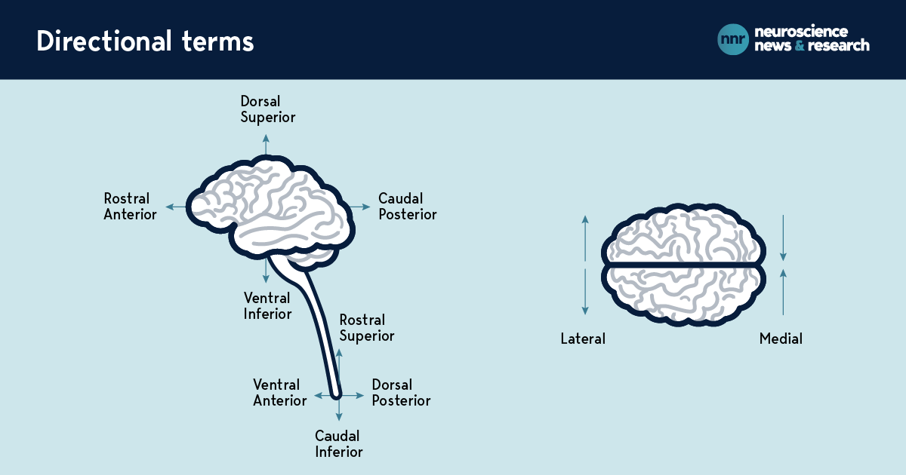

# Structure of the Brain

## Three main parts

### Brainstem
- connects brain to rest of body through spinal cord
- most of its matter is neural fibers going to and from rest of body
- has a billion neurons of its own that modulate basic essential functions (eg. breathing, heart rate, body temp, wake/sleep cycle, digestion)
- made up of the midbrain, pons, medulla

#### Midbrain (aka. mesencephalon)
- complex structure w/ different neuron clusters, neural pathways
- facilitates functions such as hearing and movement
- contains the **substantia nigra**

#### Pons
- Latin for 'bridge', as it connects the midbrain and the medulla
- the origin for 4 out of the 12 cranial nerves
- enables tear production, chewing, blinking, focusing vision, balance, hearing, etc

#### Medulla
- bottom of the brainstem, where brain meets spinal cord
- it is essential to survival
- regulates heart rhythm, breathing, blood flow, oxygen levels, etc
- involved in sneezing, coughing, swallowing, etc

### Cerebellum
- Latin for 'little brain'
- small structure located behind the brainstem; also has 2 hemispheres
- small but has tight folds - holds half of all neurons in the brain
- cerebellum is much older than the cerebrum (evolutionarily speaking)
- coordinates voluntary motor movements such as posture and balance; important for learning motor skills
- may have a role in speech

### Cerebrum
- upper portion of the brain split into left and right hemispheres
- responsible for most cognitive processing (sensory procsesing, generation of motor commands, executive functioning, memory formation, emotional regulation)
- comprises gray matter (the cerebral cortex) and white matter at its center
  - cerebral cortex = outer gray matter layer covering the cerebrum
  - cerebral cortex is covered with ridges (gyri) and folds (sulci) - folds of brain.
- deep sulci = fissures
- fissures create 4 lobes in each hemisphere
- the **corpus callosum** is a large C-shaped structure of white matter and nerve pathways at the center of the cerebrum (how the two hemispheres communicate)
- right and left hemispheres
  - right hemisphere controls left side of body; vice versa
  - right hemisphere = controls creativity, spatial ability, artistic, musical skills
  - left hemisphwere = controls speech, comprehension, arithmetic, writing

## Lobes of the brain

### Frontal Lobe

Subdivisions:
- **prefrontal cortex**
  - has important role in executive funcitoning (self control, decision-making, problem solving, planning, emotional regulation, rational thought)
  - compiles processed sensory info and makes decisions/plans goals
  - highly correlaed w/ personality traits
- **motor areas**
- **Broca's area**
  - speech production

### Temporal Lobe
- by ears
- houses the limbic system, the primary auditory cortex, Wernicke's area
- the limbic system (deep inside brain)
  - comprised of sub units involved in motivation, emotion, learning, memory, sense of smell
- primary auditory cortex = on surface of temporal lobe
  - the first stop for auditory processing in the brain
- Wernicke's area
  - behind primary auditory cortex
  - helps in language comprehension  

### Parietal Lobe
- top of head
- integrates information from our senses and directs attention (special, visual perception)
- somatosensory cortex
  - gives us our sense of touch  

### Occipital Lobe
- back of head
- visual processing (color, light, movement)
- larger than other sensory processing centers

## CNS and PNS

### Central Nervous System (CNS)
- CNS = brain + spinal cord
- the spinal cord is essentially a bundle of nerve fibers that allow brain to communicate w/ motor and sensory pathways throughout the body to allow movement and regulation of organs

### Peripherial Nervous System (PNS)
- connects the CNS to organs, muscles, and sensory areas
- peripheral nerves, which originate from the brain, are called **cranial nerves**, and usually end in the region around head/neck
- the 12 cranial nerves connect facial/neck muscles, eyes/ears/nose/mouth
- can be further divided into **somatic** and **autonomic** components
  - **somatic nervous system**: allows for voluntary movements (controlling muscles)
  - **autonomic nervous system**: manages involuntary control 9breathing, heart rate, digestion, etc)

## Localizationists vs Distributionists

### Localization Theory
- Localization theory suggests brain functions are localized to specific regions and that each neuron is vital to a task
- German anatomist Broadman ID'd 52 brain regions w/ their own unique cell structure. Theorized that each region corresponds to a function. This is partially true.

### Distribution Theory
- Distributionists believe that brain functions aren't localized but involve multiple regions of the brain
- It doesn't say regions don't specialize, but that the cognitive load is spread across multiple areas.

Reality is that it's probably a bit of both. Sensory/motor/linguistic ability are well mapped to a few specific areas; memory/higher cognitive processing is more distributed.

Research suggests that on the small scale, different functions are reliant on small clusters of neurons rather than single neurons.

## Orientation terms

