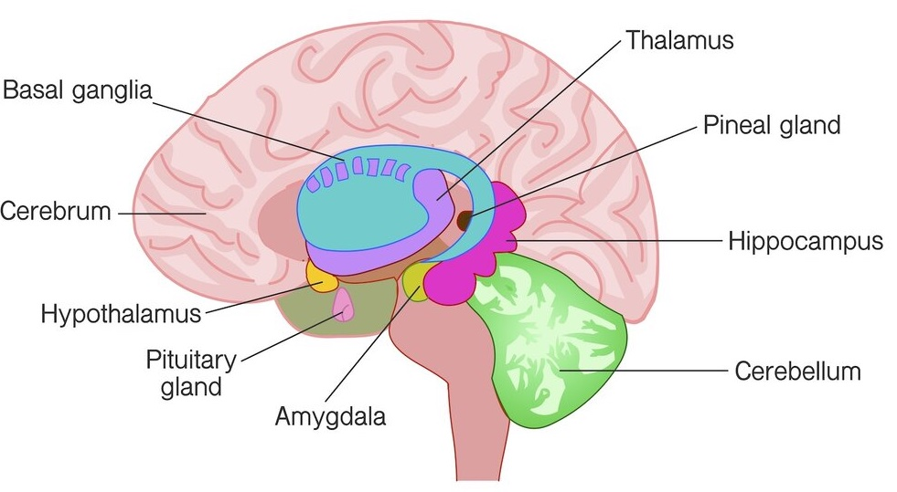

# The Limbic System

The limbic system (aka. the paleomammalian cortex) is a set of brain structures under the cerebral cortex and above the brainstem.

It primarily supports: emotion, behavior, long-term memory, smell.

It is among the oldest parts of the brain in evolutionary terms. Found in fish, reptiles, mammals.

## Hippocampus
- seahorse-shaped organs, one under each hemisphere's temporal lobe
- part of bigger structure called the **hippocampal formation**
- aids in memory, learning, navigation, spatial orientation
- where our episodic memories are formed and filed away into longterm storage in other parts of the brain
- helps with memory association w/ senses
- key structure for learning new things
- receives info from cerebral cortex
- may play a role in Alzheimer's

## Amygdala
- small, almond-shaped structures
- one located under each hemisphere
- regulates emotion/memory, brain's reward system, flight or flight response
- attaches emotional content to memories

## Basal Ganglia
- responsible for motor control, motor learning, reward/reinforcement, executive functions, emotional behaviors
- involved in addictive behaviors, habit formation
- located at the base of the cerebrum

## Thalamus
- consists of 2 lobes of grey matter under the cerebral cortex
- center for processing sensory info
- controls sleep

## Hypothalamus
- located above the pituitary gland, under the thalamus
- regulates body temperature, synchronizes sleep patterns, controls hunger/thirst
- major control center of the autonomic motor system
- sends chemical messages to the pituitary gland to control its function
- has some role in aspects of memory/emotion

## Pineal Gland
- located deep in brain
- responds to light/dark, secretes melatonin for regulating circadian rhythms

## Pituitary Gland (aka. 'master gland')
- pea-sized structure deep in the brain behind bridge of nose
- controls gland functions (hormone regulation from thyroid, adrenals, ovaries, testicles)
- produces melatonin
- receives chemical signals from hypothalamus through stalk and blood supply
